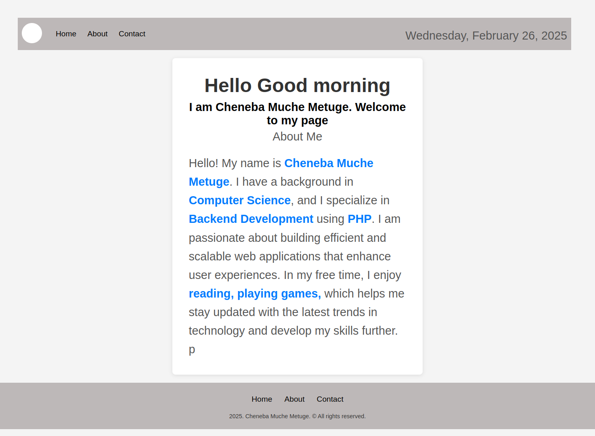
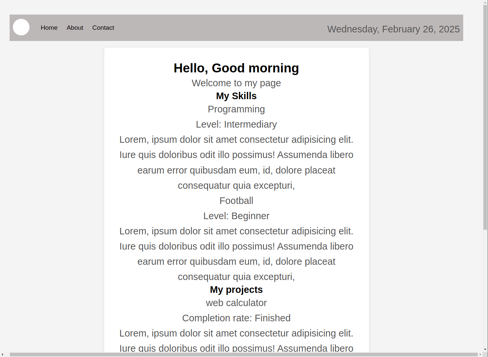
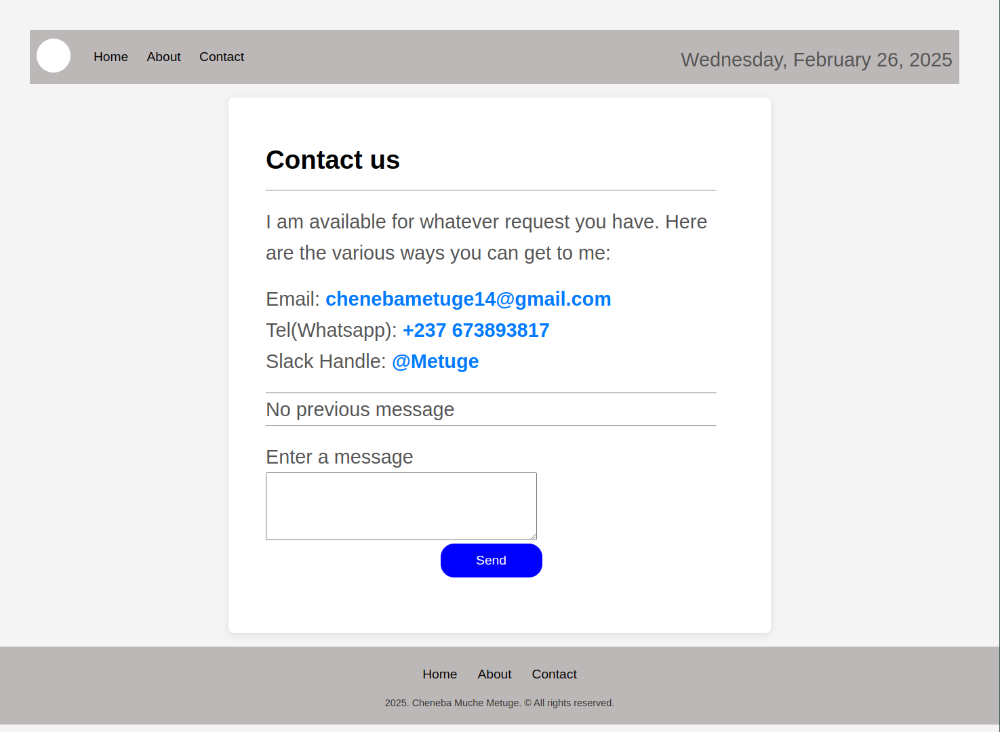

## Dynamic Portfolio Website

This is a PHP based project where in I have made the 3 included pages, that is, home, about and contact page dynamic. This dynamic nature is as follows

# The Home page

- Has dynamic greeting and input of relevant text, where relevant information are stored in variables and only used where neccesary.

# The About page

- Has listing of skills and projects. Did this using arrays in PHP and looped through then to display the skills and projects.

# The Contact page

- Displays contact info.
- It also shows a dynamic message section inwhich if a message is typed and sent it will be displayed.

# The Header

- It is universal as it is the header that all the 3 pages use.
- It contains links to all 3 pages and displays the date of the present day on the right side

# The Footer

- Same as the header it is used across all 3 pages.
- It contains Links to all 3 pages and displays the present year with the name of the author

## Usage

# Get the project

git clone https://github.com/Cheneba/task2.git

# Move task directory to htdocs

mv ./task2 /opt/lampp/htdocs/task

# Start your server

xampp /opt/lampp/xampp start

# Go to browser and tyype the following

localhost/task

## Images

